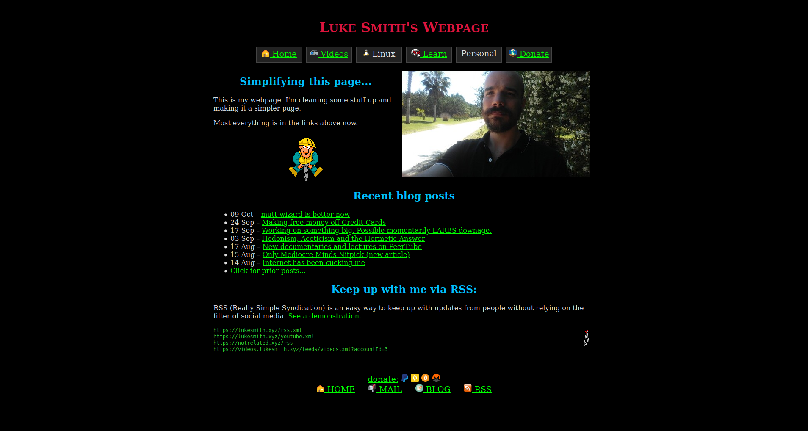
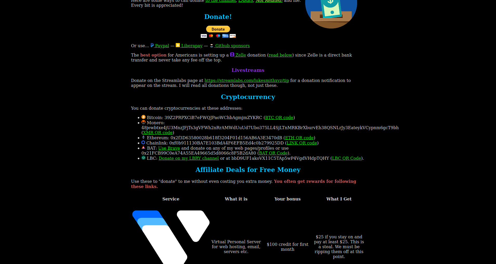
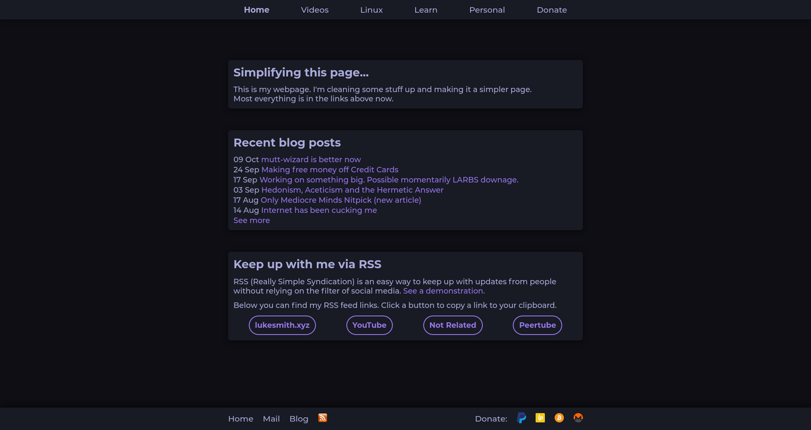
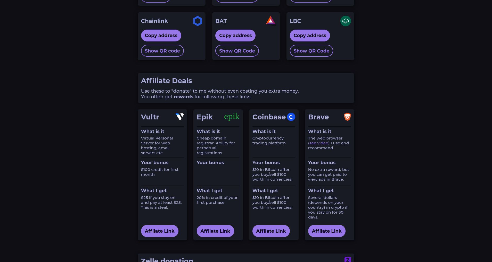

# LukeSmith.xyz

## Comparison

### Before
  



### After
  



## About

It's my attempt at improving styles of [lukesmith.xyz](https://lukesmith.xyz).
He has written the website himself. Luke is a talented man, but his design skills leave a lot to be desired.  
I'm also not a professional designer, but I tried my best to at least make the website a little more enjoyable to browse. I've the found color scheme on [uidesigndaily.com](https://uidesigndaily.com/).

## Problems with the old version

No offense Luke, but:  
- The background is just a pure blackness,
- The nav buttons are not uniform,
- The footer is a mess,
- Links have pretty ugly color,
- Headers have random colors,
- General chaos,
- Overuse of icons and Gifs (plz don't kill Luke)

## Why am I doing this?

I'm currently making projects for my portfolio. And this is one of them.  
I love [Luke Smith's videos](https://www.youtube.com/channel/UC2eYFnH61tmytImy1mTYvhA). The guy he has taught me a lot about Unix, how to be a lot more productive with computers and a lot more.  
This project is my way of thanking him for it c:


## Do I really belive that Luke will adopt my styles?

I doubt it. Even though it's easier to navigate through my UI, Luke's website still has a lot more soul than mine. There's something interesting about the layers of irony of his website. He uses Gif in 2020, because it's fun. And good for him c:  
Also, I'm using SASS, so he'd have to download Node to be able to transpile it into CSS. Can you imagine Luke Smith using Node?  
Two things he hates the most are inefficiency and soydevs. And Node's ecosystem checks both those boxes.   

## But if you like it anyway, Luke

```
sudo pacman -S nodejs npm
# TODO finish this
```